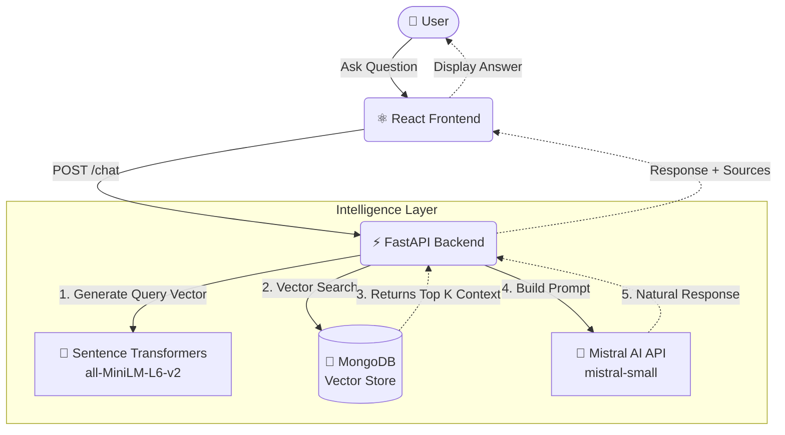

<div align="center">

# 🤖 CognitiveRAG

### Mistral AI × Vector RAG × MongoDB

**Context-aware conversational AI powered by semantic retrieval and local embeddings**

<br>

[](#)
[](#)
[](#)
[](#)
[](#)
[](#)

</div>

<br>

<div align="center">
  <em>An intelligent conversational AI system that combines Mistral AI with MongoDB Vector Search to deliver context-aware responses from your own knowledge base.</em>
</div>

<br>

## 📑 Contents

- [Overview](#-overview)
- [Features](#-features)
- [Architecture](#-architecture)
- [How It Works (RAG Workflow)](#-how-it-works-rag-workflow)
- [Tech Stack](#-tech-stack)
- [Project Structure](#-project-structure)
- [Installation](#-installation)
- [Configuration](#-configuration)
- [API Reference](#-api-reference)

---

## ✨ Features

<table>
<tr>
<td width="50%">

### 🤖 Intelligent Conversations
Natural language conversations generated by the **Mistral AI** (`mistral-small`) model, ensuring high-quality, structured answers.

</td>
<td width="50%">

### 🧠 Vector RAG
Retrieves relevant knowledge from your documents before generating responses, dramatically reducing hallucinations.

</td>
</tr>
<tr>
<td>

### 🔎 Semantic Search
Generates 384-dimensional dense vectors using `all-MiniLM-L6-v2` to understand meaning and semantic similarity, far beyond simple keyword matching.

</td>
<td>

### ⚡ Fast API Backend
High-performance asynchronous backend powered by **FastAPI** and **Uvicorn** for low-latency queries and document ingestion.

</td>
</tr>
<tr>
<td>

### 📚 Knowledge Manager
Built-in React interface to ingest, view, and manage your text documents within the MongoDB database.

</td>
<td>

### 📊 Real-time Dashboard
Monitors backend health, MongoDB connectivity, and Mistral API configuration status directly from the UI.

</td>
</tr>
</table>

---

## 🏛️ Architecture

The system follows a modular architecture separating the React frontend from the FastAPI intelligence layer.



*(Note: Requires Markdown viewer with Mermaid support to render. If not available, the flow is: User → React → FastAPI → Sentence Transformers → MongoDB → FastAPI → Mistral AI → React)*

---

## ⚙️ How It Works (RAG Workflow)

The Retrieval-Augmented Generation (RAG) pipeline executes in milliseconds to provide grounded answers:

> **01 → User Query**  
> The user submits a natural language question via the UI.

> **02 → Generate Embedding**  
> `SentenceTransformer` converts the query into a 384-dimensional vector array.

> **03 → Vector Search**  
> The system scans stored documents in MongoDB and computes the cosine similarity (dot product) against the query vector.

> **04 → Retrieve Relevant Context**  
> The top 3 most semantically similar documents are extracted.

> **05 → Build Prompt**  
> A contextualized prompt is constructed combining the user's query and the retrieved document texts.

> **06 → Mistral AI**  
> The prompt is sent to the Mistral AI API (`mistral-small` model) for processing with a low temperature (0.2) for accurate answers.

> **07 → Final Answer**  
> The generated response, along with the source context, is returned to the frontend.

---

## 💻 Tech Stack

### Frontend
- **React 18** - UI Library
- **Vite** - Build Tool
- **JavaScript (ES6+)**
- **Axios** - HTTP Client
- **Lucide React** - Icons

### Backend
- **Python 3.9+**
- **FastAPI** - Web Framework
- **Uvicorn** - ASGI Server
- **Pydantic** - Data Validation

### AI & Embeddings
- **Mistral AI** - LLM for answer generation (`mistral-small`)
- **Sentence Transformers** - Local embeddings (`all-MiniLM-L6-v2`)
- **NumPy** - Cosine similarity calculations

### Database
- **MongoDB** - Document & Vector Store (via `pymongo`)

---

## 🗂️ Project Structure

```text
RAG-based-AI-chatbot/
├── backend/
│   ├── app/
│   │   ├── models/
│   │   │   └── schemas.py       # Pydantic schemas
│   │   ├── routes/
│   │   │   ├── chat.py          # /chat endpoint
│   │   │   └── documents.py     # /documents endpoints
│   │   ├── services/
│   │   │   ├── embedding.py     # SentenceTransformer wrapper
│   │   │   ├── mistral.py       # Mistral API integration
│   │   │   └── rag.py           # MongoDB Vector Search & Pipeline
│   │   └── main.py              # FastAPI application entry
│   ├── requirements.txt         # Python dependencies
│   └── .env                     # Environment variables
│
└── frontend/
    ├── src/
    │   ├── components/          # React components (Chat, DocManager)
    │   ├── App.jsx              # Main React application
    │   ├── api.js               # Axios API client
    │   └── main.jsx             # React entry point
    ├── package.json             # Node dependencies
    └── vite.config.js           # Vite configuration
```

---

## 🚀 Installation

### 01. Clone the repository
```bash
git clone <your-repo-url>
cd RAG-based-AI-chatbot
```

### 02. Backend Setup
Navigate to the backend directory and create a virtual environment:
```bash
cd backend
python -m venv venv
source venv/bin/activate  # On Windows use: venv\Scripts\activate
```

### 03. Install Dependencies
```bash
pip install -r requirements.txt
```

### 04. Configure Environment
Create a `.env` file in the `backend` directory (see [Configuration](#-configuration)).
Ensure you have a MongoDB instance running locally (or adjust the `MONGO_URI`).

### 05. Start Backend Server
```bash
uvicorn app.main:app --host 0.0.0.0 --port 8000 --reload
```
*Note: The first time you run this, it will download the `all-MiniLM-L6-v2` model.*

### 06. Frontend Setup
Open a new terminal and navigate to the frontend directory:
```bash
cd frontend
npm install
```

### 07. Start Frontend
```bash
npm run dev
```
Access the application at `http://localhost:5173`.

---

## 🔐 Configuration

Create a `.env` file inside the `backend/` directory with the following variables:

| Variable | Purpose | Required |
|----------|---------|----------|
| `MISTRAL_API_KEY` | Your Mistral AI API key for generation. | Yes |
| `MISTRAL_API_URL` | Mistral API Endpoint (default provided). | No |
| `MONGO_URI` | MongoDB connection string. | No |
| `DB_NAME` | MongoDB database name. | No |
| `COLLECTION_NAME` | MongoDB collection for storing documents. | No |

**Example `backend/.env`:**
```env
# Mistral AI Configuration
MISTRAL_API_KEY=your_actual_api_key_here
MISTRAL_API_URL=https://api.mistral.ai/v1/chat/completions

# MongoDB Configuration
MONGO_URI=mongodb://localhost:27017
DB_NAME=rag_db
COLLECTION_NAME=documents
```

> [!WARNING]
> Never commit your actual `MISTRAL_API_KEY` to version control.

---

## 🔌 API Reference

### Health Check
**`GET /`**  
Returns the status of the backend, MongoDB connectivity, and Mistral API configuration.

### Chat
**`POST /chat`**  
Process a natural language query through the RAG pipeline.

**Request:**
```json
{
  "query": "What is Mistral AI?"
}
```

**Response:**
```json
{
  "response": "Mistral AI is an artificial intelligence company...",
  "context": [
    {
      "id": "60d5ec...",
      "text": "Document context here...",
      "score": 0.89,
      "metadata": {}
    }
  ]
}
```

### Documents Management

**`POST /documents`**  
Ingest a new text document, generate its vector embedding, and store it in MongoDB.
```json
{
  "text": "This is a sample document for the knowledge base.",
  "metadata": {"source": "manual"}
}
```

**`GET /documents`**  
Retrieve a list of all stored documents (excluding vector embeddings).

**`DELETE /documents/{doc_id}`**  
Delete a specific document by its MongoDB ID.

---

<br>

<div align="center">

🚀 **Built for Intelligent Conversations**  
Mistral AI · Vector RAG · MongoDB · FastAPI · React

*Made with ❤️ for intelligent knowledge retrieval.*

</div>
